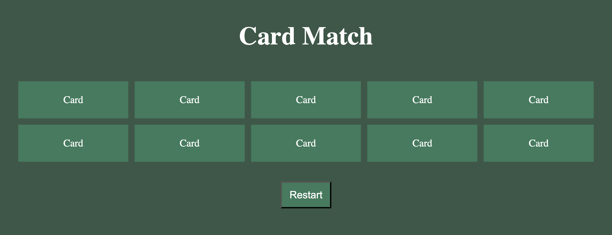

# ♠️ Matching Card Game

An interactive **10-card memory game** where you flip cards and try to find all the matching pairs. 🃏

## 📸 Project Preview 

<!-- Add your screenshot below -->


Users select two cards at a time to see if they match. Matches stay flipped, and cards that don't match flip back over.

## ✨ Features

- 10-card memory game
- Select two cards to check for a match
- Matching cards stay flipped
- Non-matching cards flip back over
- Game is complete when all cards are matched
- Dynamically update the page using JavaScript
- Simple and user-friendly interface

## 🛠️ Built With

- HTML
- CSS
- JavaScript
- Node.js


## 💡 What I Learned

This project gave me more practice building an interactive game and keeping track of what's happening on the page.

I also gained more experience working with:

- Event listeners
- DOM manipulation
- Arrays
- Conditional logic
- Comparing values
- Tracking game state
- Toggling CSS classes
- Using `setTimeout()`
- Checking for a win condition

One of the biggest takeaways was learning how to **track which cards are selected and compare them**, then decide whether they stay flipped or flip back.

## 🚀 Running the Project

To run this project locally:

1. Clone the repository:

```bash
git clone https://github.com/smayanja3/matching-card.git
```

2. Navigate into the project folder.

3. Open the project in VS Code.

4. Open `index.html` in your browser.

5. Flip the cards and find all the matches! 🃏

---

Thanks for checking out my project! ♠️✨